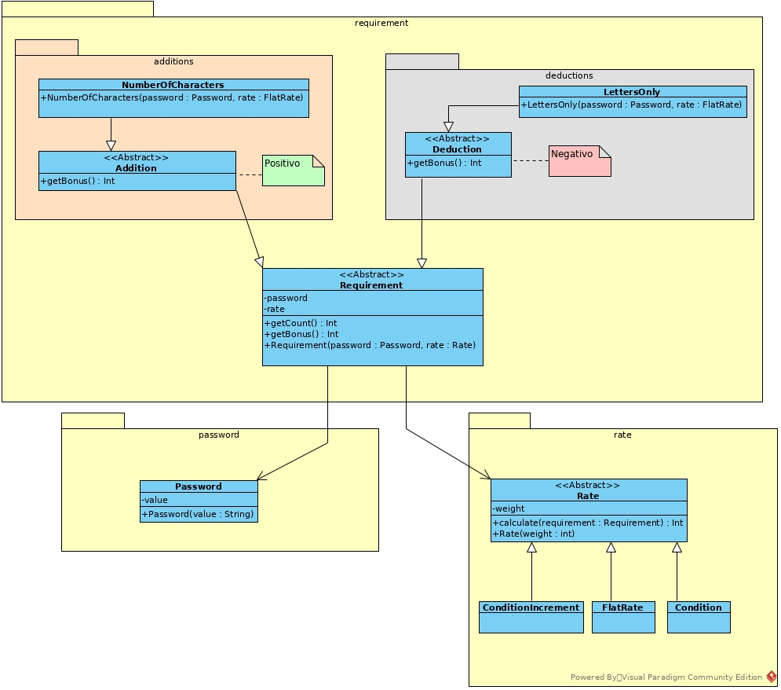

# Password Meter
Password meter in python

### Run

To run password meter, follow the command below:

`python main.py`

### Install

To install the dependencies, follow the command below:

`pipenv install`
